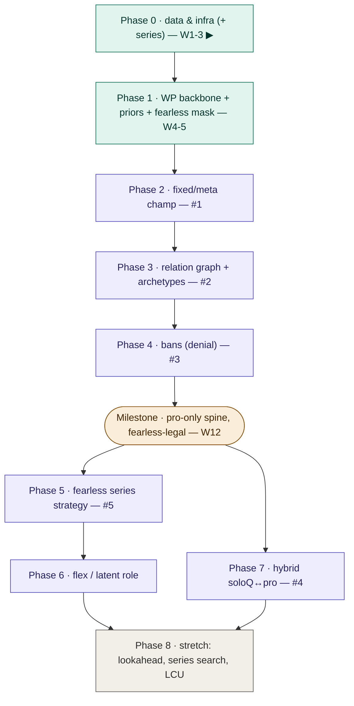

# TASKS — LoL Draft Recommender (v0)

Living tracker. Companion to `PROJECT_SPEC.md`.
- **Spec = why/how** (design; changes slowly). **Tasks = what/now** (checklist; changes constantly).
- Drive off the **▶ CURRENT FOCUS** marker. When a phase is fully checked, move ▶ down.
- Check boxes with `[x]`. Park stray ideas in the Parking Lot at the bottom rather than derailing.

Legend: `[core]` required · `[novel]` your contribution · `[stretch]` upside.

---

## Phase tree (mermaid — renders in most markdown viewers)

---

## ▶ CURRENT FOCUS — Phase 0 · Data & infra (W1–3) `[core]`

> Exit criteria: a queryable DB + a PyTorch `Dataset` that yields draft states + the
> games-per-patch number written down.

**0.1 Environment & repo**
- [x] Create repo `lol-draft`, `git init`, Python env (uv or conda)
- [ ] **Register Riot personal API key** (instant; needed as soloQ-meta fallback long before Phase 7 —
      the *production* key application is separate and slow, file it when Phase 7 approaches)
- [ ] Install: `polars`, `duckdb`, `requests`, `torch`, `torch-geometric` (PyG later is fine)
- [ ] Lay down the folder skeleton from `PROJECT_SPEC.md` §5
- [ ] (defer) Hydra + Weights & Biases — add when training starts in Phase 1

**0.2 First data look — the gating numbers** *(do this before any modeling)*
- [ ] Download one Oracle's Elixir CSV (latest full year) from oracleselixir.com
- [ ] Load in DuckDB; inspect the 12-rows-per-game layout
- [ ] Confirm the pick-order and ban columns exist; write down the column mapping
- [ ] **Count distinct games per patch** → record the number here: `____`
- [ ] Count distinct (champion, patch) pairs → record: `____`
- [ ] Decision note: small per-patch N ⇒ lean harder on fixed attributes + Phase 6

**0.2b Entity-resolution spike** *(1 day, BEFORE committing to the full dual-source ingest — spec §2)*
- [ ] Join **50 games** Oracle's Elixir ↔ Leaguepedia (game / player / team IDs); log every mismatch
- [ ] Decision note: Leaguepedia = first-class source, or fallback to OE-only
      (OE alone = picks + pick order, bans unordered ⇒ lose only the ordered-ban analysis)

**0.3 Schema & ingest**
- [ ] Write `schema.sql` (the tables in `PROJECT_SPEC.md` §2.1; `draft_actions` PK = `(game_id, seq_index)`)
- [ ] **As-of aggregation views** (spec §2.2): `meta_asof(champion, date)` = previous-patch stats,
      `edges_asof(date)` = train-window-only relation stats — leakage structurally impossible
- [ ] `ingest_oracle.py`: CSV → normalized tables
- [ ] Sanity queries: row counts, FK integrity, per-champion winrate matches the CSV

**0.4 Enrich**
- [ ] Riot Data Dragon → `champion_attributes` (the fixed `v_attr`)
- [ ] Leaguepedia (`leaguepedia-parser`) → full ban order + player metadata; reconcile IDs
- [ ] (optional) gol.gg spot-check: a few drafts vs your DB

**0.4b Series & fearless** *(needed for Phase 5 — set it up now while in the data)*
- [ ] Reconstruct series: populate `series` + `games.series_id` / `game_in_series` (Leaguepedia is cleanest)
- [ ] Build `fearless_config` lookup by hand (event + date → none/soft/hard) from the adoption timeline
- [ ] Derive helper: per (series, game) → fearless-unavailable set (both-teams for hard, same-team for soft)
- [ ] **Count fearless series per patch** → record: `____` (tells you if Phase 5 has enough data)

**0.5 Dataset & splits**
- [ ] `dataset.py`: emit a draft *state* sample (picks/bans so far, turn, side, patch, players)
- [ ] `splits.py`: future-patch splitter (train ≤T, val T+1, test T+2+)
- [ ] EDA notebook: pick/ban frequency, patch coverage, role distributions

---

## Phase 1 · WP backbone + priors (W4–5) `[core]`

> Exit: **both** WP models (structured spine + black-box antagonist) beat both priors on a held-out
> **future** patch; `recommend()` works through the structured value.

- [ ] Prior A — meta tier-list (top-winrate champ per role/patch)
- [ ] Prior B — player-comfort (player's best champ per role from history)
- [ ] Tokenizer: champion ⊕ role ⊕ side ⊕ patch (players added later)
- [ ] **Structured spine (the model):** additive value → logistic/FM WP read-out team-vs-team,
      BCE on outcomes — trains base / syn / ctr (spec §3.3a)
- [ ] **Black-box set-Transformer (the antagonist):** same data, same mask, no availability structure —
      the baseline the centerpiece experiment beats; also the raw-fit ceiling check (spec §3.3b)
- [ ] **Exposure operator:** `vuln(c,r) ≡ ctr(r,c)` (transpose — no separate scorer, no untrained
      params); softmax over `A_enemy`, uniform weights in v0 (pick-likelihood weights arrive in Phase 4)
- [ ] Train loop + metrics: accuracy, AUC, **Brier / ECE** (calibration) — for BOTH models
- [ ] Future-patch eval harness (as-of features only, spec §2.2); confirm both models > priors
- [ ] **Fearless-correct mask:** `F` also removes the series consumed-set (cheap; makes the model legal)
- [ ] Greedy recommendation read-out (argmax V over feasible set — always through the structured value)

---

## Phase 2 · Fixed/meta champion encoder (W6–7) `[novel]` — contribution #1

- [ ] `z_fix(a_c)` MLP over intrinsic attributes
- [ ] `z_meta(c, π)` patch-conditioned component + gate — inputs are **shrunk** meta stats
      (empirical-Bayes toward previous patch / global prior, weight ∝ n_games; spec §3.1)
- [ ] `base(c|π)` head reads from `z_c` — **never** a free (champion, patch) table
- [ ] Ablation: ID-only vs +fixed vs +meta on unseen-champion / future-patch
- [ ] Plot: generalization gap narrows with fixed attributes

---

## Phase 3 · Relation graph + archetypes (W8–9) `[novel]` — contribution #2

- [ ] Build synergy / counter / shared-role edges from match stats — **train-window only / as-of**
      (`edges_asof`, spec §2.2; full-dataset edges leak into future-patch eval)
- [ ] GNN (PyG) over the static graph → champion embeddings feed the WP model
- [ ] Archetype clustering + soft-assignment head
- [ ] Interpretability: per-pick attribution ("synergy with X / counter to Y")
- [ ] Archetype-map visualization (the visual artifact)
- [ ] **Synthetic counter-consumption probe, v0** (centerpiece dry-run — needs NO fearless data):
      remove champ `c`'s top-k counters from `A` on real drafts → ΔV dose-response, structured vs
      black-box (spec §3.8 metric 1). If this doesn't separate the models, find out NOW, not in Phase 5

---

## Phase 4 · Player-conditioned bans (W10–11) `[novel]` — contribution #3

- [ ] Enemy pick-likelihood head (from histories)
- [ ] `BanValue(c)` = WP delta over enemy comfort picks
- [ ] **Wire pick-likelihood into the exposure weights** `w_r` (spec §3.0/§3.6 — one head, two
      read-outs: bans and exposure are the same mechanism)
- [ ] Eval: top-k ban accuracy vs actual pro bans (**sanity only** — measures predictable, not good,
      bans) + the WP-delta denial case study that carries the argument

---

## ◆ Milestone · pro-only spine ships (W12)

- [ ] End-to-end on a real draft: data → WP → recommend + bans + explanations
- [ ] **Centerpiece probe figure v0** (from Phase 3) in the writeup — the paper's primary result
      already exists at the milestone, before any fearless data is touched
- [ ] Draft of the short writeup (problem, method, results vs priors + DraftRec + the black-box antagonist)
- [ ] Repo `README` + a reproducible run command

---

## Phase 5 · Fearless series strategy `[novel]` — gap 6, contribution #5

> The most novel piece — no prior model handles fearless. Mask-correctness already shipped in Phase 1;
> this is the strategic modeling on top.

- [ ] Consumed-pool summary fed to the WP backbone (dual-pooled: our-consumed vs their-consumed)
- [ ] Series-context features: `game_in_series`, series score, `fearless_mode`
- [ ] Remaining-pool player conditioning (comfort = best *remaining* champion)
- [ ] Eval: with vs without series-state, broken down by `game_in_series`
- [ ] **Stratified rank agreement** on real fearless states (advantage should concentrate in the
      consumed-counters stratum — spec §3.8 metric 2)
- [ ] **Late-series calibration**: Brier/ECE by `game_in_series` (spec §3.8 metric 3)
- [ ] Champion-diversity figure per series (the Riot-facing result)
- [ ] Recency split: train earlier-2025 series, test later

---

## Phase 6 · Flex / latent role `[novel]` — gap 2

- [ ] `q(r | c, π)` role distribution from data
- [ ] Marginalize over role assignments in the team encoder
- [ ] Flex-value metric (entropy) + analysis (amplified under fearless — pairs with Phase 5)

---

## Phase 7 · Hybrid soloQ ↔ pro `[novel]` — contribution #4

- [ ] **File the Riot production API key application** (personal key done in 0.1; production approval takes time)
- [ ] `ingest_riot_soloq.py` → soloQ matches + player histories
- [ ] Reconcile champion / patch / role / player IDs across domains
- [ ] Stage A: pretrain champion + relation + player encoders on soloQ WP
- [ ] Stage B: init from A; fine-tune order-aware backbone + heads on pro (domain token)
- [ ] Consistency rule: represent pros via their **soloQ** accounts through the shared encoder
- [ ] soloQ-replay guard against catastrophic forgetting
- [ ] Ablation: pro-only vs hybrid; domain/patch separability check

---

## Phase 8 · Stretch `[stretch]`

- [ ] One-step opponent-reply model → shallow lookahead / MCTS
- [ ] Multi-game series search (true fearless meta-game over the Bo5)
- [ ] LCU client: read the live champ-select session
- [ ] Live demo: paste 10 op.gg profiles → recommendations + explanations

---

## Paper (throughout)

- [ ] Maintain the related-work delta table (vs DraftArtist, JueWuDraft, NeuralAC, DraftRec)
- [ ] Log every ablation result the day you get it
- [ ] Figures: archetype map · generalization plot · ban case study · champion-diversity-per-series

---

## Parking lot (revisit later, don't derail now)

- (add stray ideas here)
